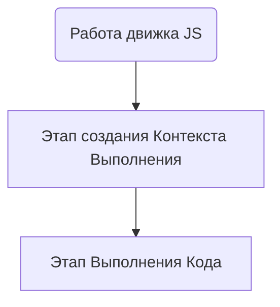
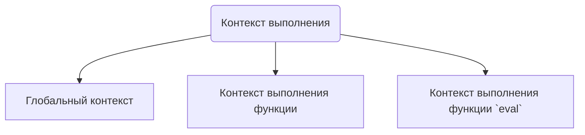

*references*: [[JS Engine]]
*related*: [[Ключевое слово 'this']], [[Стэк]], [[Лексическое Окружение(LexicalEnvironment)]], [[Окружение переменных(VariableEnvironment)]], [[Теория компиляторов]]
*tags*: #article #JS_functions #expand 

*sources*: https://habr.com/ru/company/ruvds/blog/422089/

expend: https://developer.mozilla.org/en-US/docs/Web/API/HTML_DOM_API/Microtask_guide/In_depth

---

*why i read the article*: 

Узнать, что такое контекст выполнения

*questions i want to know answer for*:

*key ideas of the article*: 

Работа движка JS состоит из двух этапов: этап создания контекста выполнения и этап выполнения кода. Эти этапы следуют друг за другом. 



---

## Этап создание Контекста Выполнения

Контекст выполнения - это окружение, в котором производиться выполнение кода, специальная внутренняя структура данных, которая содержит информацию о вызове функции. Она включает в себя конкретное место в коде, на котором находится интерпретатор, локальные переменные функции, значение `this` и прочую служебную информацию.  

В JS есть три вида контекста выполнения: глобальный контекст, контекст выполнения функции и контекст выполнения функции `eval`.



Когда движок JS начинает обработку скрипта он создает глобольный контекст выполнения и помещает его в текущий стек вызовов. При обнаружении команды вызова функции создается новый контекст выполнения функции, который добавляется в верхнюю часть стэка вызовов. Движок выполняет функцию с верха стека, когда работа функции завершается, ее контекст извлекается из стэка, а управление передается контексту, лежащей ниже в стэке.
```js 
let a = 'Hello World!'; 
function first() {  
	console.log('Inside first function'); 
	second();  
	console.log('Again inside first function'); 
} 
function second() {  
	console.log('Inside second function'); 
} 
first(); 
console.log('Inside Global Execution Context');
```
![[Pasted image 20220619154707.png]]

В процессе создания контекста выполнения выполняются три действия:

1. Определяется и выполняется привызяка значение  [[Ключевое слово 'this'|this]] (`this binding`).
2. Создается [[Лексическое Окружение(LexicalEnvironment)]].
3. Создается [[Окружение переменных(VariableEnvironment)]].

```js
let a = 20;
const b = 30;
var c; 
function multiply(e, f) { 
	var g = 20; 
	return e * f * g; 
} 
c = multiply(20, 30);

GlobalExectionContext = {  
	ThisBinding: <Global Object>,  
	LexicalEnvironment: {    
		EnvironmentRecord: {      
			Type: "Object",      
			// Данные о привязках для идентификаторов      
			a: < uninitialized >,      
			b: < uninitialized >,      
			multiply: < func >,
			test: < func >    
		}    
		outer: <null>  
	},  
	VariableEnvironment: {    
		EnvironmentRecord: {      
			Type: "Object",      
			// Данные о привязках для идентификаторов      
			c: undefined,    
		}    
		outer: <null>  
	} 
} 
FunctionExectionContext = {  
	ThisBinding: <Global Object>,  
	LexicalEnvironment: {    
		EnvironmentRecord: {      
			Type: "Declarative",      
			// Данные о привязках для идентификаторов      
			Arguments: {0: 20, 1: 30, length: 2},    
		},    
		outer: <GlobalLexicalEnvironment>  
	}, 
	VariableEnvironment: {    
		EnvironmentRecord: {      
			Type: "Declarative",      
			// Данные о привязках для идентификаторов      
			g: undefined    
		},    
		outer: <GlobalLexicalEnvironment>  
	} 
}
```

---

## Этап Выполнения Кода

На этой стадии происходит присвоение значений переменным и выполнение кода. Если движок не найдет значение переменной объявленной	с помощью `let`, то значение будет `undefined`.