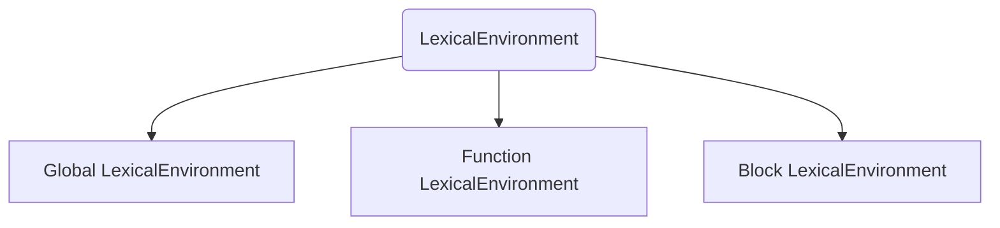
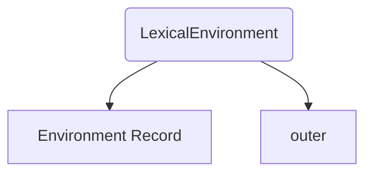
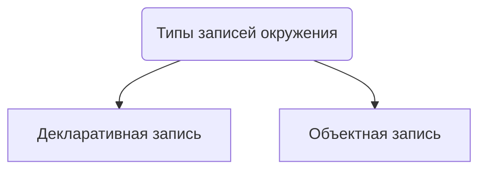

*references*: [[JS Functions]],[[JS Objects]], [[JS Engine]]
*related*: [[Замыкание]], [[Контекст выполнения (execution context)]]
*tags*: #article #JS_functions 

*sources*:  https://learn.javascript.ru/closure#leksicheskoe-okruzhenie

*why i read the article*: 

Выяснить как работает лексическое окружение в JS. Это необходимо для понимания темы [[Замыкание]].

*questions i want to know answer for*:

*key ideas of the article*: 

## Что такое лексическое окружение

**Лексическое окружение** `(LexicalEnvironment)` - это скрытый внутренний объект, который хранит информацию о соответствии индификаторов и переменных. Индификатор - это имя переменной или функции, переменная - это ссылка на объект, примитив или функцию.  Лексическое окружение создается с каждой выполняемой функцией, блоком кода и скриптом. Бывает трех видов: глобольное, окружение функции и блочное лексическое окружение.

_Область видимости_ — это набор правил поиска переменных по их идентификатору. 

*Лексическая область видимости* — это область видимости, которая определена во время разбора на лексемы, это набор правил о том, как именно _Движок_ может искать переменную и как он ее может найти.



Лексическое окружение состоит из двух частей: 
1. `Environment Record` - объект, в котором хранятся все локальные переменные в виде свойств. Так же другая информация, такая как значение  `this`.
2. `outer`  - ссылка на внешнее лексическое окружение, которое соответствует коду снаружи от фигурных скобок.


**Переменная** - это свойство специально внутреннего объекта: `Environment Record`. Получить или изменить переменную значит получить или изменить свойство этого объекта.
Глобальное лексическое окружение связанное со всем скриптом.

![[Пример лексического окружения.png]]

Функции сохраняют в `Environment Record` по другому. Подробнее об этом в заметке [[Способы объявления функций в JS]].

---

## Типы записей	окружения

Существует два типа записей окружения:
1. Декларативная запись окружения, которая хранит переменные, функции и параметры. В окружении функции запись окружения содержит объект `arguments`, который хранит соответствия между индексами и значениями аргументов, а так же количество этих аргументов.
2. Объектная запись окрежения, хранит информацию о переменных и функция в глобальном контексте. 

 
 Лексическое окружение можно преставить в виде псевдокода. 
```js
GlobalExectionContext = {  
	LexicalEnvironment: {    
		EnvironmentRecord: {      
			Type: "Object",      
			// Данные о привязках для идентификаторов    
		}    
		outer: <null>  
	} 
} 

FunctionExectionContext = {  
	LexicalEnvironment: {    
		EnvironmentRecord: {      
			Type: "Declarative",      
			// Данные о привязках для идентификаторов    
		}    
		outer: <Ссылка на глобальное окружение или на окружение внешней функции>  
	} 
}
```
 
 В глобальном лексическом окружении запись представлена в виде **объектной записи**, а в окружении функции - **декларативной записью**.

---

## Внутреннее и внешнее лексическое окружение

Пример:
```js 
let phrase = 'Hello';
function say(name) {
	alert(`${phrase}, ${name}`);
}
say('John');
```
Как это работает с лексическим окружением:
1. Создается внешнее лексическое окружение.
2. В `Environment Record` добавляется функция, т.к. она объявлена с помощью Function Declaration.
3. В `Environment Record` добавляется переменная `phrase`.
4. Происходит вызов функции. Создается лексическое окружение для функции. 
5. Внутренне лексическое окружение функции добавляет в `Environment Record` переменную `name` и создает `outer` с ссылкой на внешнее лексическое окружение, в данном случае на глобальное лексическое окружение. 
6. Внутреннее лексическое окружение функции получает доступ к внешней переменной `phrase`.

![[Пример лексического окружения с внутренним лексическим окружением.png]]

Когда коду необходимо получить доступ к переменной, в первую очередь происходит поиск во внутреннем лексическом значении. Если там переменной нет поиск продолжается во внешнем лексическом окружении, на которое указывает ссылка `outer`. Поиск продолжается до глобального лексического окружения, если переменная не объявлена возвращается `undefined` .
>[!INFO] Свойство `[[Environment]]`
> При создании все функции получают скрытое свойтво `[[Environment]]`, в котором хранится ссылка на лексическое окружение, в котором функция была созданна. Значение `[[Environment]]` функция присваивает `outer` собственного лексического окружения при вызове.

> [!INFO] Один вызов - одно лексическое окружение
> Новое лексическое окружение создается каждый раз, когда функция выполняется. Если функция выполняется несколько раз это значит, что для каждого вызова создается свой набор переменных и ссылок на внешнее окружение.

> [!INFO] Лексическое окружение - это специальный внутренний объект
> К нему нет доступа из вне. Его нельзя изменить напрямую. Движок JS оптимизирует его.
